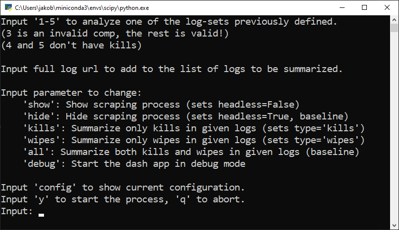
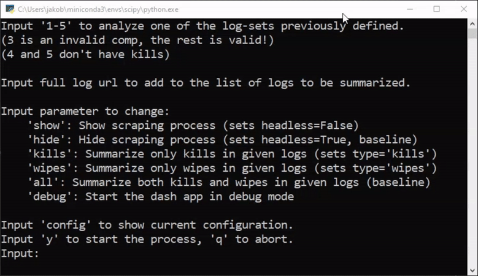
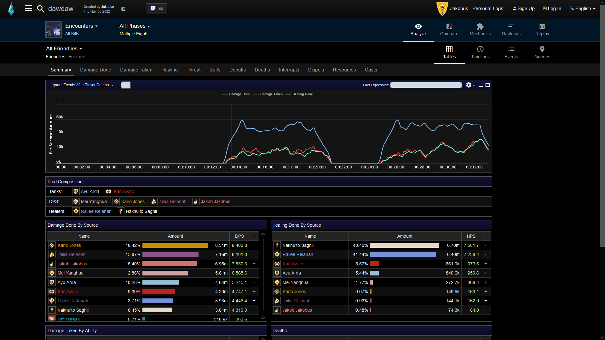
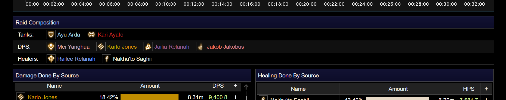
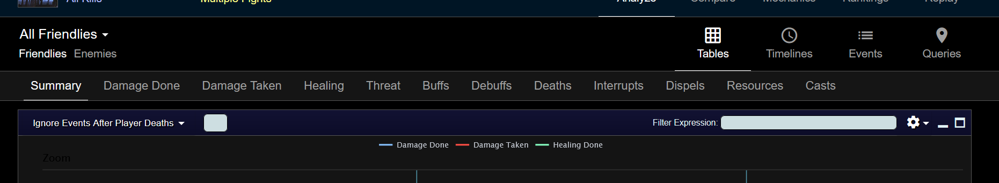
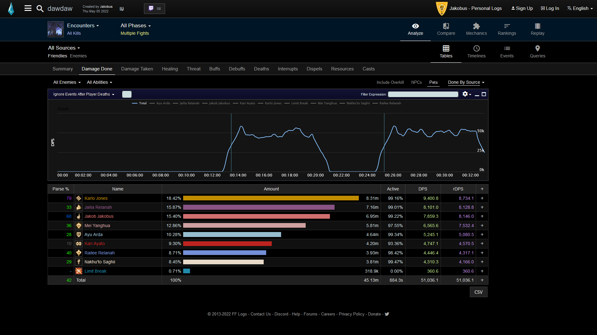
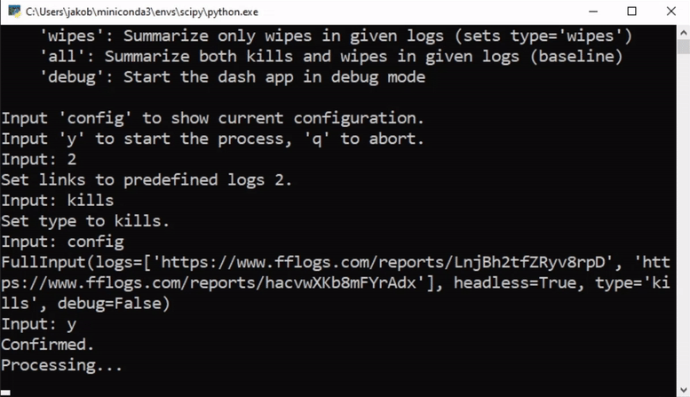
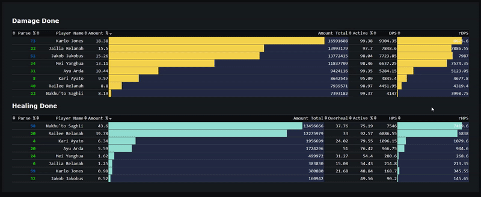

# Resume application project
Scrape [fflog](https://www.fflogs.com/) entries for damage done and healing done tables, combine data from multiple logs and then visualize using a dash dashboard.

## Requirements

* Python 3.10
> `user_input.py` makes use of the `match-case` syntax ([structural pattern matching](https://docs.python.org/3/whatsnew/3.10.html)). This was introduced in Python 3.10.

* Selenium
* BeautifulSoup4
> `data_scraping.py` methods make use of both [Selenium](https://www.selenium.dev/documentation/webdriver/) and [BeautifulSoup](https://www.crummy.com/software/BeautifulSoup/bs4/doc/).
> Conveniently, fflog entries offer `download csv` buttons for all their tables. We can utilize those with Selenium so that we don't have to manually fetch table data from html.
> We still use beautifulsoup to fetch the group composition from html.

* Pandas

## Example

For the example we will look at the predefined logs 2. The set consists of 2 logs that have boss kills in them ([1](https://www.fflogs.com/reports/hacvwXKb8mFYrAdx), [2](https://www.fflogs.com/reports/LnjBh2tfZRyv8rpD)).

### User Input
On run we are prompted with a user input:  
  
The available parameters should be explained sufficiently. Since we want to analyze boss kills from set 2 in this example, we input "2" and "kills". If you want to see the scraping process, you can input "show" and the Webdriver will be visible.  "config" shows the parameters that will be returned.  

  

### Scraping

We can now take a look at what the scraping process (implemented in `data_scraping.py`) is going to do. The following will be repeated for every url we provide (2 times in this case). If we open the [first](https://www.fflogs.com/reports/hacvwXKb8mFYrAdx) log and click on "All Kills (2)" we land on this summary page:  
  

On this page, the contents of the "Raid Composition" table will be fetched to make sure that the group composition in every log is the same. We check classes/jobs instead of player names - these are indicated by the icons and colors (to understand the reasons for this is not important for this project).  

  

Next, the Webdriver navigates do the subpage for "damage done". We can get there by clicking on the "Damage Done" tab.  

  

On this page, the Webdriver is simply going to download the main table as a csv file, using the "CSV" button on the bottom right. It then repeats the same for the "healing done" suppage.  

  

### Data Summary

In `data_combination.py` the csv files just downloaded will be read into pandas dataframes and summarized.

### Data Visualization

When all this is finished, the terminal will show where the Dash app is running:  
  

Open this (e.g. in your browser) and you will see this dashboard with sortable columns:
  
