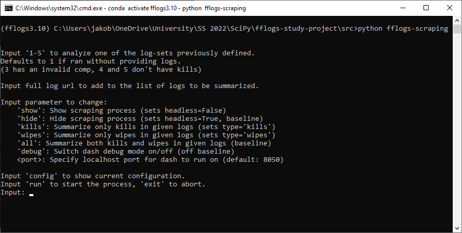

<a name="fflogs-scraping"></a>
# fflogs-scraping
Scrape [fflog](https://www.fflogs.com/) entries for damage done and healing done tables, combine data from multiple logs and then visualize using a dash dashboard.

<a name="table-of-contents"></a>
## Table of contents
- [fflogs-scraping](#fflogs-scraping)
  - [Table of contents](#table-of-contents)
  - [Introduction](#introduction)
    - [Goal and Motivation](#goal-and-motivation)
    - [Structure](#structure)
  - [Requirements](#requirements)
  - [Getting Started](#getting-started)
    - [Windows](#windows)
    - [Others](#others)
  - [Example](#example)
    - [User Input](#user-input)
    - [Scraping](#scraping)
    - [Data Summary](#data-summary)
    - [Data Visualization](#data-visualization)
  - [Documentation](#documentation)
  - [Why Selenium?](#why-selenium)
  - [Why Dash?](#why-dash)
  - [Possible Additions/ Changes](#possible-additions-changes)

<a name="introduction"></a>
## Introduction

<a name="goal-and-motivation"></a>
### Goal and Motivation

The website fflogs.com allows extensive analysis of combat data from the video game Final Fantasy XIV, including metrics like "damage done" and "healing". While you are able to analyze date over whole log files that were uploaded; looking at, and summarizing data across multiple logs is not possible. This project's purpose is to implement this functionality in a limited manner.  

It should be able to
1. take user inputs, indicating what logs to analyze and other parameters,
2. scrape "damage" and "healing" data from all logs,
3. summarize/ merge the data in an appropriate way and
4. visualize it.

<a name="structure"></a>
### Structure

```
fflogs-scraping
├── src
│   ├── fflogs-scraping
│   │   ├── data
│   │   │   ├── assets
│   │   │   │   └── style.css
│   │   │   ├── csv
│   │   │   │   └── placeholder.csv
│   │   │   ├── __init__.py
│   │   │   ├── combination.py
│   │   │   ├── scraping.py
│   │   │   └── visualization.py
│   │   ├── __init__.py
│   │   ├── __main__.py
│   │   ├── main.py
│   │   └── user_input.py
│   ├── geckodriver.exe
│   └── ublock_origin-1.43.0.xpi
├── .gitignore
├── LICENSE.txt
├── MANIFEST.in
├── README.rst
├── readthedocs.yaml
├── requirements.txt
├── setup.cfg
└── setup.py
```

<a name="requirements"></a>
## Requirements

* Python 3.10
> `user_input.py` makes use of the `match-case` syntax ([structural pattern matching](https://docs.python.org/3/whatsnew/3.10.html)). This was introduced in Python 3.10.

* Selenium
* BeautifulSoup4
> `data.scraping` methods make use of both [Selenium](https://www.selenium.dev/documentation/webdriver/) and [BeautifulSoup](https://www.crummy.com/software/BeautifulSoup/bs4/doc/).
> Conveniently, fflog entries offer `download csv` buttons for all their tables. We can utilize those with Selenium so that we don't have to manually fetch table data from html.
> We still use beautifulsoup to fetch the group composition from html.

* Pandas
  
* Dash

* Firefox
> Since we use a Firefox webdriver we need a full-install of [Firefox](https://www.mozilla.org/en-US/firefox/new/).

* Geckodriver
> For our Firefox webdriver to run, Geckodriver needs to be installed. More on information on this in [Getting Started](#start). (a Chrome Webdriver would need Chromedriver)

<a name="getting-started"></a>
## Getting Started

<a name="windows"></a>
### Windows
To use this project, directly install the conda environment from the .yml, using

```
conda env create -f environment.yml
```

Activate the environment

```
conda activate fflogs3.10
```

Navigate to the `src` directory and run

```
python fflogs-scraping
```

To work on this project, please instead install the dependencies from `requirements.txt` in your (Python 3.10) environment, using

```
pip install -r requirements.txt
```
This includes `sphinx` for creating the documentation.
<a name="others"></a>
### Others
Geckodriver needs to be installed for the Firefox Webdriver to work. On Windows, it is sufficient for the executable to be in the working directory. On other operating systems that might not work. Please refer to [this](https://askubuntu.com/questions/870530/how-to-install-geckodriver-in-ubuntu) post for solutions.

After having installed geckodriver, continue as described in [Windows](#windows).

<a name="example"></a>
## Example

For the example we will look at the predefined logs 2. The set consists of links to 2 logs that have boss kills in them ([1](https://www.fflogs.com/reports/hacvwXKb8mFYrAdx), [2](https://www.fflogs.com/reports/LnjBh2tfZRyv8rpD)).

<a name="user-input"></a>
### User Input
On run we are prompted with a user input:  
  
The available parameters should be explained sufficiently. Since we want to analyze boss kills from set 2 in this example, we input "2" and "kills". If you want to see the scraping process, you can input "show" and the webdriver will be visible.  "config" shows the parameters that will be returned. Input "run" to start the scraping.

  

<a name="scraping"></a>
### Scraping

We can now take a look at what the scraping process (implemented in `data.scraping`) is going to do. The following will be repeated for every url we provide (2 times in this case). If we open the [first](https://www.fflogs.com/reports/hacvwXKb8mFYrAdx) log and click on "All Kills (2)" we land on this summary page:  
> Note: The webdriver isn't actually clicking anywhere - it navigates by modifying the url. I just explain it like this so you can retrace its steps more easily.
  

On this page, the contents of the "Raid Composition" table will be fetched to make sure that the group composition in every log is the same. We check classes/jobs instead of player names - these are indicated by the icons and colors (to understand the reasons for this is not important for this project).  

  

Next, the webdriver navigates do the subpage for "damage done". We can get there by clicking on the "Damage Done" tab.  

  

On this page, the webdriver is simply going to download the main table as a csv file, using the "CSV" button on the bottom right. It then repeats the same for the "healing done" suppage.  

  

<a name="data-summary"></a>
### Data Summary

In `data.combination` the csv files just downloaded will be read into pandas dataframes and summarized.

<a name="data-visualization"></a>
### Data Visualization

When all this is finished, the terminal will show where the Dash app is running:  
  

Open this (e.g. in your browser) and you will see this dashboard with sortable columns:
  

<a name="documentation"></a>
## Documentation
The code was written and documented following the [Google Python Style Guide](https://google.github.io/styleguide/pyguide.html). It was linted using Flake8 (not pylint).
> There are 5 single lines where the line length of 80 (as required by both Pep8 and Google Style) was exceeded, because I decided that in those few cases, splitting the line would harm readability more than it would help.  

You can find the documentation [here](https://fflogs-study-project.readthedocs.io/en/latest/index.html). It was built using [Sphinx](https://www.sphinx-doc.org/en/master/index.html) and is hosted on [readthedocs](https://docs.readthedocs.io/en/stable/index.html).


<a name="why-selenium"></a>
## Why Selenium?
In hindsight, this is a good question. Since fflogs offers a "Download CSV" functionality for all of its tables, it seemed to be the most intuitive way for me to implement a program that "just clicks that button". While it is true that you need Selenium for this kind of functionality, just fetching the table data from html would have been much more effective in all terms, but especially runtime.  

If I would start this project now, I would not use Selenium. Setting up a Webdriver, installing an adblocker only to click on some buttons, where you could just have fetched 2 tables instead is kind of "overkill". I might consider creating a more light-weight version completely without Selenium in the future.

<a name="why-dash"></a>
## Why Dash?
When beginning this project I said that I'd like to visualize the merged data, preferably somewhat interactively. I started by using Plotly as introduced in the lecture and while looking something up in its documentation, I read about Dash. It sounded interesting enough to give it a try; in the end it let me visualize the data in exactly the way I wanted (sortable table with an in-cell bar chart, like on the original website).

<a name="possible-additions-changes"></a>
## Possible Additions/ Changes

* Proper command-line interface, e.g. with argparse
* Unittests, possibly utilizing tox
* Class-/Job-colors on Dashboard
* html-scraping for all tables (get rid of Selenium)
* all-in-one dashboard (with inputs, settings, etc)